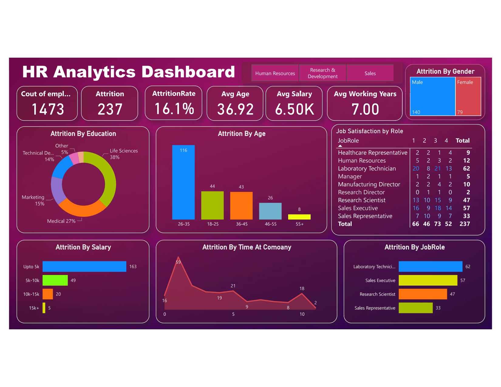

# Data Analyst

#### Technical Skills: 
                       ###- Python | SQL | Power BI 
                       ###- Advanced Excel | DATA MANIPULATION 
                       ###- DATA HANDLING | DATA VISUALIZATION

## Projects
### HR Analytics Dashboard with Power BI

-	Developed an insightful analytics dashboard for the HR department.
-	 Analysed attrition rates in correlation with factors such as job satisfaction, salary, and age.
-	Implemented effective data visualization techniques to present information in a user-friendly manner.

### Walmart Sales Analysis with Python Pandas
-	Analysed the performance of sales and revenue at the city and branch level
-	Identified average prices per branch, informing tailored pricing strategies and deepening insights into regional consumer behavior.
-	Analysed sales and revenue performance across product lines, genders, and payment methods, identifying key focus areas for improving sales.

[Code](https://github.com/JoyM25/PYTHON-Code)

## Education
- B.Tech. - Civil | Hooghly Engineering And Technology College(_July 2023_) Grade- 8.34 CGPA								       		
- class 12th(science), | Koutrong Bhadrakli Highschool (_December 2016_)	Percentage- 57% 			        		
- class 10th, | Uttarpara Amarendra Vidyapeeth (_May 2014_) Percentage- 66%

## COURSES & CERTIFICATIONS
### Python Course
### MySQL                    

## OTHER INTERESTS
STOCK MARKET | FASHION | HIKING | MOTORSPORT | DESIGN

